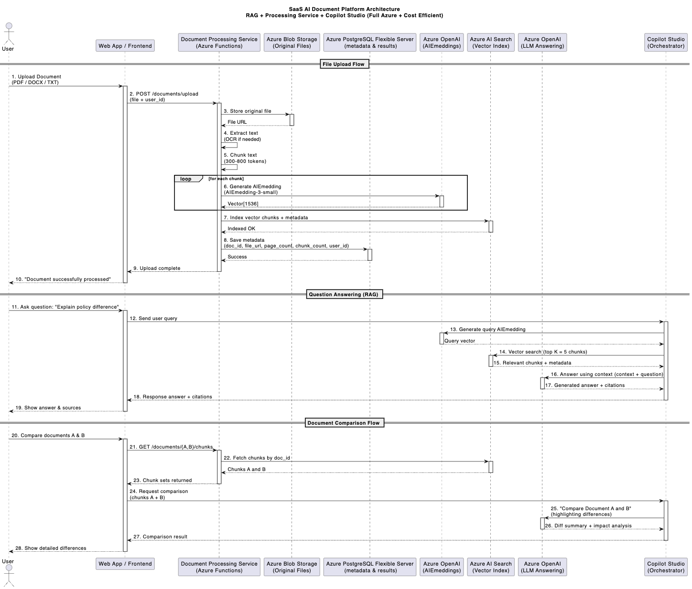

# 🟦 AI Document Analyzer – Azure-Based RAG Platform

*A Retrieval-Augmented Document Intelligence System powered by Azure OpenAI, Azure AI Search, and Copilot Studio.*

---

## Table of Contents

1. [Overview](#1-overview)
2. [Key Features](#2-key-features)
3. [Architecture](#3-architecture)
4. [Detailed Workflows](#4-detailed-workflows)
    - [Document Upload & Processing](#41-document-upload--processing)
    - [Question Answering (RAG)](#42-question-answering-rag)
    - [Document Comparison](#43-document-comparison)
5. [Database Schema](#5-database-schema)
6. [API Endpoints](#6-api-endpoints)
7. [Estimated Azure Cost](#7-estimated-azure-cost)
8. [Deployment Guide](#8-deployment-guide)
9. [Roadmap](#9-roadmap)
10. [Example Use Cases](#10-example-use-cases)
11. [Error Handling](#11-error-handling)

---

## 1. Overview

AI Document Analyzer is a serverless Azure-based SaaS platform that enables organizations to:

* Upload documents (PDF, DOCX, TXT, scanned images)
* Extract, index, and semantically search document content
* Ask questions and receive answers with citations
* Compare two documents and generate difference summaries
* Access all features through a Copilot Studio conversational interface

This architecture uses **Microsoft Azure end-to-end**, focusing on **cost-efficiency**, **scalability**, and **low operational overhead**.

---

## 2. Key Features

### 🔍 Document Ingestion & OCR

* Supports PDF, Word, plain text, and scanned images
* Automatically extracts text using Azure AI Document Intelligence
* Includes document structure and page-level metadata

### 🧠 RAG: Retrieval-Augmented Generation

* Text chunking (300–800 tokens)
* Azure OpenAI embeddings (`text-embedding-3-small`)
* Vector indexing in Azure AI Search
* LLM synthesis with verified citations

### 📑 Document Comparison

* Semantic comparison between Document A and Document B
* Change detection and difference explanation
* Impact analysis using Azure OpenAI LLM

### 🤖 Copilot Studio Integration

* Central orchestration for embeddings → search → LLM
* Natural language interface for Q&A, summaries, and diff analysis

### 🗄 Minimal Metadata Model

* No user identity stored
* Document-level metadata only (id, file_url, page_count, chunk_count)

---

## 3. Architecture

### High-Level Architecture Diagram

```
User → Web App → Azure Functions → Blob Storage
                            ↓
                      OCR & Extraction
                            ↓
             Embedding Generation (Azure OpenAI)
                            ↓
                Azure AI Search (Vector Index)
                            ↓
               Azure OpenAI (LLM Responses)
                            ↓
                     Copilot Studio Bot
                            ↓
                            User
```



### Azure Components

| Component           | Azure Service                         |
| ------------------- | ------------------------------------- |
| Frontend            | Static Web App / App Service          |
| Backend API         | Azure Functions (HTTP Trigger)        |
| File Storage        | Azure Blob Storage                    |
| OCR & Extraction    | Azure AI Document Intelligence        |
| Metadata Store      | Azure PostgreSQL Flexible Server      |
| Vector Database     | Azure AI Search (Vector Capabilities) |
| Embeddings          | Azure OpenAI                          |
| LLM Reasoning       | Azure OpenAI                          |
| Orchestration Layer | Copilot Studio                        |

---

## 4. Detailed Workflows

### 4.1 Document Upload & Processing

1. The user uploads a document through the UI
2. The frontend sends the file to Azure Functions (`/documents/upload`)
3. The file is saved to Blob Storage
4. OCR and text extraction are performed as needed
5. Text is chunked into 300–800 token segments
6. Each chunk is embedded using Azure OpenAI
7. Embedding vectors are stored in Azure AI Search
8. Document metadata (document_id, file URL, page count, chunk count) is stored in PostgreSQL
9. The upload operation completes

---

### 4.2 Question Answering (RAG)

1. The user asks a question
2. Copilot Studio receives the query
3. The query is embedded using Azure OpenAI
4. The vector is sent to Azure AI Search (Top-K search)
5. Relevant chunks are returned
6. Copilot builds a context prompt and sends it to Azure OpenAI
7. The LLM returns the final answer + citations
8. The result is returned to the user

---

### 4.3 Document Comparison

1. The user selects Document A and Document B
2. Backend retrieves their chunks from PostgreSQL and AI Search
3. Copilot sends a comparison prompt to Azure OpenAI
4. The model returns semantic differences and impact analysis
5. The frontend displays the structured comparison result

---

## 5. Database Schema

### Table: `documents`

| Field       | Type      |
| ----------- | --------- |
| id          | UUID      |
| name        | TEXT      |
| file_url    | TEXT      |
| status      | TEXT      |
| page_count  | INT       |
| chunk_count | INT       |
| created_at  | TIMESTAMP |

---

### Table: `document_chunks`

| Field       | Type |
| ----------- | ---- |
| id          | UUID |
| document_id | UUID |
| chunk_index | INT  |
| content     | TEXT |
| vector_id   | TEXT |

---

### Table: `query_log`

*(Does not store user identity — only raw operations)*

| Field      | Type      |
| ---------- | --------- |
| id         | UUID      |
| question   | TEXT      |
| answer     | TEXT      |
| created_at | TIMESTAMP |

---

## 6. API Endpoints

### `POST /documents/upload`

Uploads and processes one or multiple documents.

#### Request
- **Method**: `POST`
- **Content-Type**: `multipart/form-data`

**Form Data Fields**:
- `files[]`: Array of document files to upload (PDF, DOCX, TXT, or images).

#### Response

**Success Response**:
- **Status Code**: `200 OK`
- **Body**:
```json
{
  "documents": [
    {
      "document_id": "uuid1",
      "file_url": "https://blobstorage.example.com/documents/filename1.pdf",
      "status": "Processing",
      "page_count": 10,
      "chunk_count": 5,
      "created_at": "2025-12-01T12:00:00Z"
    },
    {
      "document_id": "uuid2",
      "file_url": "https://blobstorage.example.com/documents/filename2.docx",
      "status": "Processing",
      "page_count": 15,
      "chunk_count": 8,
      "created_at": "2025-12-01T12:01:00Z"
    }
  ]
}
```

**Error Response**:
- **Status Code**: `400 Bad Request`
- **Body**:
```json
{
  "message": "Invalid file format. Supported formats are PDF, DOCX, TXT, and images."
}
```

- **Status Code**: `500 Internal Server Error`
- **Body**:
```json
{
  "message": "An unexpected error occurred while processing the documents."
}
```

### `GET /documents/{id}`

Retrieves metadata and the processing status of a specific document.

#### Request
- **Method**: `GET`
- **URL Parameters**:
  - `id` (string, required): The unique identifier of the document.

#### Response

**Success Response**:
- **Status Code**: `200 OK`
- **Body**:
```json
{
  "document_id": "uuid",
  "name": "example.pdf",
  "file_url": "https://blobstorage.example.com/documents/example.pdf",
  "status": "Processed",
  "page_count": 10,
  "chunk_count": 5,
  "created_at": "2025-12-01T12:00:00Z"
}
```

**Error Response**:
- **Status Code**: `404 Not Found`
- **Body**:
```json
{
  "message": "Document not found."
}
```

- **Status Code**: `500 Internal Server Error`
- **Body**:
```json
{
  "message": "An unexpected error occurred while retrieving the document."
}
```

### `POST /ask`

Runs a RAG-based question query.

```json
{
  "question": "Summarize the confidentiality section."
}
```

### `GET /documents/{id}/chunks`

Retrieves the chunks of a specific document for comparison purposes.

#### Request
- **Method**: `GET`
- **URL Parameters**:
  - `id` (string, required): The unique identifier of the document.

#### Response

**Success Response**:
- **Status Code**: `200 OK`
- **Body**:
```json
{
  "document_id": "uuid",
  "chunks": [
    {
      "chunk_index": 0,
      "content": "This is the content of the first chunk.",
      "vector_id": "vector123"
    },
    {
      "chunk_index": 1,
      "content": "This is the content of the second chunk.",
      "vector_id": "vector124"
    }
  ]
}
```

**Error Response**:
- **Status Code**: `404 Not Found`
- **Body**:
```json
{
  "message": "Document not found."
}
```

- **Status Code**: `500 Internal Server Error`
- **Body**:
```json
{
  "message": "An unexpected error occurred while retrieving the document chunks."
}
```

---

## 7. Estimated Azure Cost

| Component                          | Cost   |
| ---------------------------------- | ------ |
| Azure AI Search (S1)               | $45–65 |
| Azure OpenAI Usage                 | $15–45 |
| Blob Storage                       | <$5    |
| PostgreSQL Flexible Server (Basic) | $20–60 |
| Azure Functions                    | <$3    |
| Static Web App / App Service       | $5–15  |

**Total Estimated Cost:** **$90–150/month**
(Highly cost-efficient for early SaaS.)

---

## 8. Deployment Guide

### Prerequisites

* Azure subscription
* Azure OpenAI approval
* Azure CLI installed

### Steps

1. Deploy Azure Functions backend
2. Create Blob Storage (documents container)
3. Provision PostgreSQL Flexible Server
4. Create Azure AI Search instance with vector capabilities
5. Enable Azure OpenAI resource
6. Connect Copilot Studio to your Functions endpoints
7. Deploy frontend as Static Web App or App Service

---

## 9. Roadmap

| Status       | Feature                           |
| ------------ | --------------------------------- |
|  [x]  | OCR & text extraction             |
|  [ ]  | RAG Q&A                           |
|  [ ]  | Document comparison               |
|  [ ]  | Automatic document classification |
|  [ ]  | Section-based summaries           |
|  [ ]  | Export-to-PDF reports             |
|  [ ]  | Advanced search filters           |

---

## 10. Example Use Cases

* Contract analysis and summarization
* HR policy understanding
* Document comparison
* Invoice and procurement review
* Academic and technical document analysis

---

## 11. Error Handling

### Overview

This document outlines the error handling mechanisms and common error responses for the AI Document Analyzer platform.

### 4.1 Document Upload & Processing Errors

| Error Code | HTTP Status | Message                                                   |
|------------|-------------|-----------------------------------------------------------|
| 1001       | 400         | Invalid file format. Supported formats are PDF, DOCX, TXT, and images. |
| 1002       | 500         | An unexpected error occurred while processing the documents. |

### 4.2 Question Answering (RAG) Errors

| Error Code | HTTP Status | Message                                                   |
|------------|-------------|-----------------------------------------------------------|
| 2001       | 400         | Bad request. Please ensure the document_id is valid and the question is well-formed. |
| 2002       | 404         | Document not found. Please check the document_id.        |
| 2003       | 500         | An unexpected error occurred while processing the query.  |

### 4.3 Document Comparison Errors

| Error Code | HTTP Status | Message                                                   |
|------------|-------------|-----------------------------------------------------------|
| 3001       | 400         | Bad request. Please ensure both documents are uploaded and processed. |
| 3002       | 404         | One or both documents not found. Please check the document IDs. |
| 3003       | 500         | An unexpected error occurred while comparing documents.   |

### General Errors

| Error Code | HTTP Status | Message                                                   |
|------------|-------------|-----------------------------------------------------------|
| 9001       | 500         | Internal server error. Please try again later.            |
| 9002       | 503         | Service unavailable. Please try again later.              |

### Notes

* Error responses are in JSON format.
* All error codes are prefixed by the category (e.g., 1001, 2001, 3001, etc.).
* Common HTTP status codes are used (400 for client errors, 500 for server errors).
* Error handling is integrated into the Azure Functions with standardized responses.